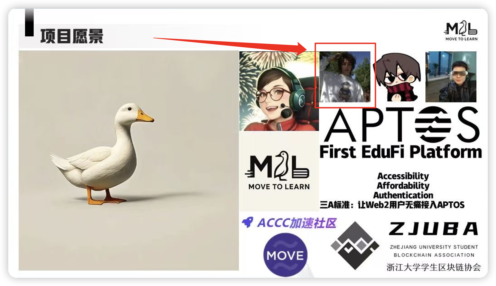

# 一. AI 模型应用理解:

1. GPT-4模型工作原理及文本生成中的应用场景:
- 工作原理:
  - 基于Transformer架构的大规模语言模型
  - 通过自注意力机制处理上下文信息
  - 采用预训练+微调的训练方式
  - 具有1750亿参数量的深度神经网络

- 应用场景:
  - 智能写作和内容创作
  - 多语言翻译
  - 代码编程辅助
  - 问答系统
  - 文本摘要生成
  - 数据分析报告撰写

2. Claude 3.7 Sonnet模型在代码生成方面的优势:
- 优势特点:
  - 代码理解能力强,可准确理解开发需求
  - 支持多种编程语言
  - 代码质量高,符合编程规范
  - 上下文理解准确,生成代码更符合业务逻辑
  - 具备代码解释和优化建议能力

- 应用举例:
  - 快速生成样板代码
  - API接口开发
  - 单元测试用例生成
  - 代码重构优化
  - Bug修复建议

> **⚠️注意：根据本人使用经验，3.7 think 能力比3.5更强，但同时幻觉效应也更加显著，根据长时间的编码经验所得，3.5可能反而更加适合日常工作中的编码，而3.7在处理逻辑和思考方面更胜一筹。但总体而言，目前编码方面仍需要工程师的强参与和把关，否则会导致各种幻觉问题，业务理解偏差等一系列的问题，从而造成各种不可控和工作量不减反增的现象。**

# 二. 业务流程优化案例分析:

## 问题描述
公司希望通过 AI 技术优化客服服务流程，设计一个 AI 驱动的客服用户流程优化方案，并说明预期的业务效果。

## 作答：

### 1.真实案例
本人参与**香港Aptos**黑客马拉松使用3个小时打造出了一款AI Agent 智能客服助手，该助手主要涉及到有关
- 1. 语义理解 - 通过大语言模型准确理解用户问题的语义和意图
- 2. 问题拆分 - 将复杂问题拆分为多个子问题进行处理
- 3. 知识库检索 - 基于向量数据库实现智能知识检索
- 4. 多轮对话 - 支持上下文关联的多轮对话交互

#### **相关证据如下：**

